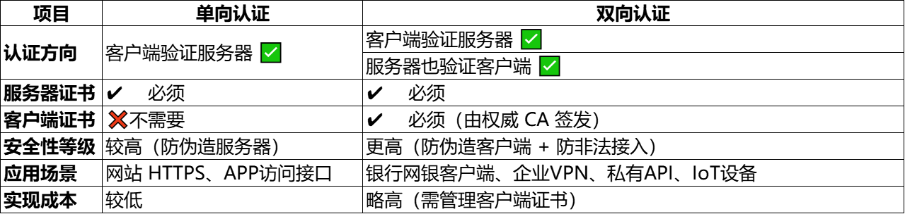

# 双向模式

## 1. 生成服务端 keystore
keytool -genkeypair -alias serverkey -keyalg RSA -keysize 2048 -keystore server-keystore.jks -storepass zte123 -keypass zte123 -dname "CN=localhost" -validity 365

## 2. 导出服务端公钥证书
keytool -exportcert -alias serverkey -keystore server-keystore.jks -file server-cert.cer -storepass zte123

## 3. 生成客户端 keystore
keytool -genkeypair -alias clientkey -keyalg RSA -keysize 2048 -keystore client-keystore.jks -storepass zte123 -keypass zte123 -dname "CN=client" -validity 365

## 4. 导出客户端证书
keytool -exportcert -alias clientkey -keystore client-keystore.jks -file client-cert.cer -storepass zte123

## 5. 导入客户端证书到服务端 truststore
keytool -importcert -file client-cert.cer -keystore server-truststore.jks -alias clientcert -storepass zte123 -noprompt

## 6. 导入服务端证书到客户端 truststore
keytool -importcert -file server-cert.cer -keystore client-truststore.jks -alias servercert -storepass zte123 -noprompt

