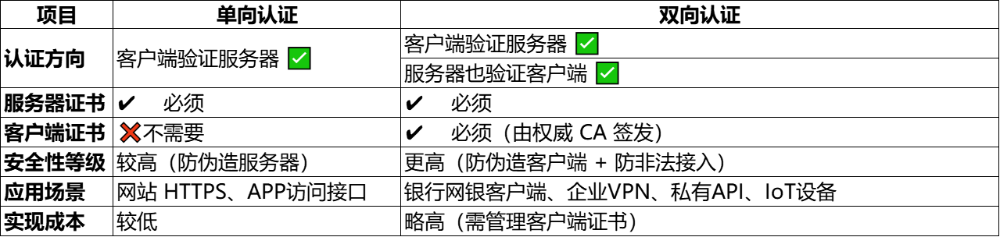
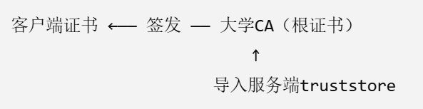

# 单向模式

##1. 生成服务端 keystore（密码设为 zte123）
keytool -genkeypair -alias serverkey -keyalg RSA -keysize 2048 -keystore server-keystore.jks -dname "CN=localhost" -storepass zte123 -validity 365

##2. 导出服务端公钥证书
keytool -exportcert -alias serverkey -keystore server-keystore.jks -file server-cert.cer -storepass zte123

##3. 客户端导入证书到 truststore（信任服务端）
keytool -importcert -keystore client-truststore.jks -alias servercert -file server-cert.cer -storepass zte123 -noprompt

## 非常典型的场景1：
客户端数量庞大（如学生），服务端无法手动管理每一个客户端证书，那就必须通过 CA 根证书或中级证书来统一验证，即：

### ✅ 服务端如何验证学生客户端证书？
只要客户端证书是由可信 CA 签发的，服务端只需导入 CA 的根证书或中间证书，Java 会自动校验客户端证书链是否合法。

### 🧱 实现方案概览
✅ 步骤：
1. 学校/平台使用私有 CA 或购买的机构 CA 签发所有学生证书。
2. 服务端只需导入 这个 CA 的根证书（或者中间证书）到 truststore。
3. 客户端发起连接时提供自己的证书，Java 会自动进行链式验证:
 - 是否是由该 CA 签发
 - 是否过期
 - 是否被吊销（可选）
 - 验证成功则建立 TLS 连接，失败则拒绝。

✅ 运行机制图解：
 
- Java 会自动验证客户端证书是否由 truststore 中信任的 CA 签发。

🔐 附加：如何生成并签发学生客户端证书？
如果你使用 OpenSSL 或私有 CA 管理体系：
1. 签发客户端证书
 - openssl genrsa -out student.key 2048
 - openssl req -new -key student.key -out student.csr
 - openssl x509 -req -in student.csr -CA university-ca.crt -CAkey university-ca.key -CAcreateserial -out student.crt -days 365

